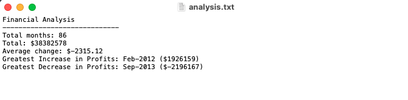

# Python Bank and Elections Summary

### Summary | GRADE: A
This assignment was divided into two parts. In the first, I was given daily transaction data for a fictional bank which I looped through using Python to generate a topline summary. For the second, I was given election data, which I loope through using Python to calculate the winner and display the election results.

### Solution Writeup
#### PyBank
After importing dependencies and reading the csv into the code, I created a Loop that combs through each row of the csv. It includes a running counter of months, a summation of each day's profits and losses, and calculated the difference between the current row and the previous row. This is appended to a list, to caculate the average change between each day. It also checks for the greatest increase/decrease by storing the current greatest/least, comparing that to the current row, and replacing it if the value is higher or lower respectively. 

Once all the data is collected, the rest of the code is used to display the results as formatted above both in the command line and in a txt document.

#### PyPoll
After importing dependencies and reading the csv into the code, I set a list of vote totals set to 0 to start. Then I created a Loop that combs through each row of the csv. The loop checks the candidate name and then assigns that vote to the proper index in the list. 

After calculating vote totals, a loop through the vote totals list was used to change that number into a percent. Lastly, a final loop checks which candidate has the most votes. 

Once all the data is collected, the rest of the code is used to display the results as formatted above both in the command line and in a txt document.

